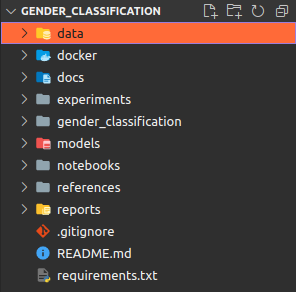

<p align="center">
  <a href="" rel="noopener">
 </a>
</p>

<h1 align="center">CookieCutter Template for Machine Learning projects </h1>

## 🧐 About

My project is a Cookiecutter template designed to streamline the process of creating a new machine learning project. 

With this template, users can quickly generate a standardized project structure that includes directories for data, models, and notebooks, as well as files for documentation and configuration. The template is highly customizable, allowing users to include any additional files or directories they may need. By using this template, machine learning practitioners can save time and ensure consistency across their projects.

## 📃 Requirements
* python 3.6+
* cookiecutter

Cookiecutter can be installed with pip by or conda depending on how you manage your Python packages:
```
$ pip install cookiecutter
```

or
```
$ conda config --add channels conda-forge
$ conda install cookiecutter
```

## 🏁 Getting Started  

Generate your new project by running the following command and following the prompts:
 

```bash
$ cookiecutter git@github.com:honejzy/cookiecutter-machine-learning.git
```

Then the cookiecutter command ask for several questions on generated project as follows.

```bash
project_name [Enter the fullname of the project]: Gender Classification
project_slug [gender_classification]: 
project_description [Enter a description of the project for README]: Project for gender classification task
username [Enter your name for README]: Name Surname
Select use_docker_hub_image:
1 - yes
2 - no
Choose from 1, 2 [1]: 1
docker_hub_image_name [Enter the name of the Docker image from Docker Hub]: pytorch/pytorch:1.13.0-cuda11.6-cudnn8-runtime
```
Then you get the generated project directory, gender-classification.



## 🌳 Initial directories and files
-----------------------------

The following is the initial directory structure generated in the previous section.

    │                                      
    ├── data               <- data directory contains the input resources.
    │   ├── interim             <- intermediate data that has been transformed.
    │   ├── processed           <- the final, canonical data sets for modeling.
    │   └── raw                 <- the original, immutable data dump.
    |
    ├── docker             <- docker directory contains Dockerfile.
    │   |
    |   └── Dockerfile          <- base Dockerfile contains the basic settings.
    |
    ├── docs               <- docs directory contains the documents.
    │   ├── img                 <- for images which use in README.
    │   └── materials           <- various documents describing the project: articles, documentation.
    |
    ├── experiments        <- directory for model experiments.
    |
    ├── models             <- model directory store the best models files created in the experiments.
    |   └── README.md           <- README for best models. Describe and compare best models.
    |
    ├── notebooks          <- this directory stores the ipynb files saved in Jupyter Notebook.
    |
    ├── references         <- additional libraries for the current project.
    |
    ├── reports            <- generated analysis as HTML, PDF, LaTeX, etc.
    |   └── figures             <- generated graphics and figures to be used in reporting
    |
    ├── your_project       <- cookie-cutter-machine-learning creates the directory whose name is same
    │   │                                as project name. In this directory users puts python files used in scripts
    │   │                                or Jupyter Notebook.
    │   ├── __init__.py
    |   |
    |   ├── config             <- directory for configs
    |   |   └── config.yaml
    |   |
    |   ├── data                         <- scripts to download or generate data
    |   |   |
    |   |   ├── dataset.py               <- init your dataset
    |   |   ├── make_dataset.py          <- download or generate data
    |   |   └── preprocessed_dataset.py  <- script for data preprocess
    |   |
    |   ├── metrics            <- directory for different metrics
    |   |   └── metrics.py
    |   |
    |   ├── models             <- directory for models 
    |   |   └── metrics.py
    |   |
    |   ├── scripts            <- directory for models
    |   |   |
    |   |   ├── inference.py              
    |   |   ├── postprocess.py    
    |   |   ├── preprocess.py
    |   |   ├── test.py 
    |   |   └── train.py
    |   | 
    |   ├── utils              <- utils for your project
    |   |   |
    |   |   ├── manager.py               <- manager for experiments (mlflow, clearml)  
    |   |   └── utils.py
    |   |
    |   └── visualize          <- directory for visualization scripts
    |
    ├── .gitignore 
    |  
    ├── requirements.txt       <- libraries needed in the pro|ject. The library listed in this file
    │                                         are installed in the Docker images for not only development but also production.
    └── README.md              <- template for readme.

## ❕ Note
This is just a project template. You can delete or create new folders and files you need.
